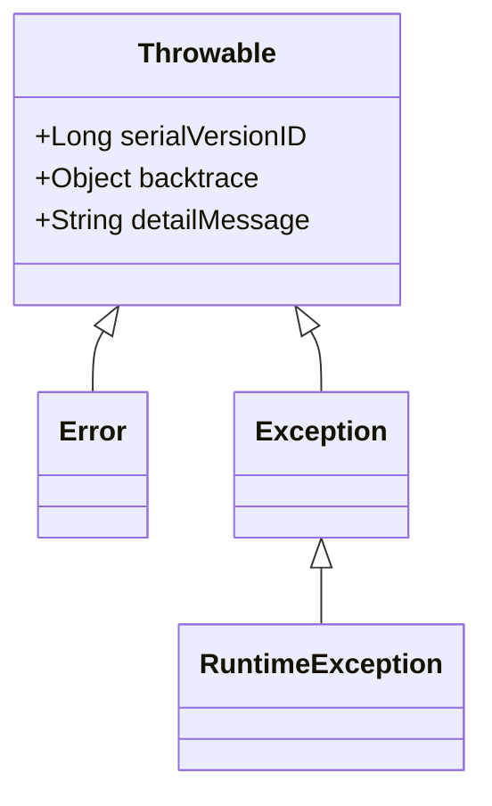

---

title: 'java throwable class'
date: 2023-02-19
---

# Throwable

## 类型介绍

The following class diagram is the inheritance diagram about the `Throwable`:




Error用于表示严重的问题，通常是由于 JVM 或系统级别的错误引起的。

Exception一般性异常，是通常是由程序逻辑、输入错误或外部环境导致的，所以在开发过程中这个更常见。

### 常见类

Error：

- OutOfMemoryError
- StackOverflowError
- NoClassDefFoundError
- ClassNotFoundException
- NoSuchMethodError

RuntimeException：

- NullPointerException
- ArithmeticException
- ClassCastException
- IndexOutOfBoundsException
- IllegalArgumentException

OtherException（除RuntimeException）：

- FileNotFoundException
- ClassNotFoundException
- SQLException
- NoSuchFieldException
- NoSuchMethodException
- ParseException

## 用法

`Throwable`的实现类可以通过`throw`关键字抛出异常，当抛出的`Throwable`的实现类经过整个调用栈过程中没被捕获处理，将会导致当前线程的从抛出异常的位置退出，后面的代码将无法被执行。捕获处理使用`try/catch`语法，但该语法只针对`Exception`生效，所以抛出的`Error`类及子类将注定当前线程的退出。

### Error vs Exception vs RuntimeException

在`Throwable`继承关系中，我们只需要关心`Error`，`Exception`和`RuntimeException`。

先说结论：

| 类名             | 编译期间是否检查 | try-catch捕获是否生效 |
| ---------------- | ---------------- | --------------------- |
| Error            | 是               | 否                    |
| Exception        | 是               | 是                    |
| RuntimeException | 否               | 是                    |

*根据Java编译器是否会在编译器检查异常分为`unchecked`和`checked`异常，根据上述描述可以了解`RuntimeException`为非受查，其他未受查。*

## 异常捕获处理

### 捕获异常：try&catch&finally

``` java
try{...} 
// one or more catch statements
catch (<$EX_CLASS> <$VAR_NAME> [|<$EX_CLASS> <$VAR_NAME> [...]]){...}
finally{...}
```

- **try**：运行代码，若遇到异常则try内代码停止运行  
- **catch**：若前者出现异常，将捕获异常并运行catch代码  
	若前者为出现异常，则无法捕获异常，catch内代码也不会运行  
- **finally**：无论是否出现异常，无差别运行finally内代码  

**try内声明的变量只能在try内部使用**  

示例：

``` java
public class DealException
{
    public static void main(String args[])
    {    
        try
        //要检查的程序语句
        {
            int a[] = new int[5];
            a[10] = 7;//出现异常
        }
        catch(ArrayIndexOutOfBoundsException e)
        //异常发生时的处理语句
        {
            System.out.println("超出数组范围！");
        }
        finally
        //这个代码块一定会被执行
        {
            System.out.println("*****");
        }
        System.out.println("异常处理结束！");
    }
}
```
Tips：  
1. 一个try语句可以对应多个catch语句
2. 若存在多个catch语句，按照java.lang.Object类从子到父排列  
3. 一个catch语句可以捕捉多个异常，不同异常之间用`|`隔开  
4. 异常类声明的对象默认被final修饰  

### 抛出异常：throw
`throw <$EX_OBJ>`  
其他异常抛出来自代码逻辑，throw是主观意愿的手动抛出异常  
两者最终结果的作用相同  
出现在函数体中，抛出异常后终止  

### 声明异常：throws
`func throws <$EX_OBJ>`  
将自身异常提交给上级（调用者/JVM）  
从而确保自身在编译过程中不出现异常  


## 自定义异常
1. 创建类

2. 继承Exception或Exception的子类

3. 重写构造方法

  如何让自定义异常发挥作用？

  依靠throw来抛出自定义的异常  
```java
public class NoMappingParamString extends Exception {
    //无参构造函数
    public NoMappingParamString(){
        super();
    }
    
    //用详细信息指定一个异常
    public NoMappingParamString(String message){
        super(message);
    }
    
    //用指定的详细信息和原因构造一个新的异常
    public NoMappingParamString(String message, Throwable cause){
        super(message,cause);
    }
    
    //用指定原因构造一个新的异常
    public NoMappingParamString(Throwable cause) {
        super(cause);
    }
}
```
