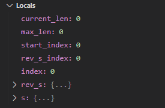
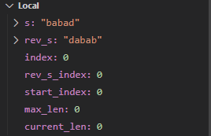

# Rust Tutorial

Rust 教程

## 安装

这里安装 `Rustup` ，`Rustup` 是一组套件，其中包含 `cargo`、`clippy`、`rust-docs`、`rust-std`、`rustc` 等工具，同时可以管理这些工具。

**for Linux**

```sh
curl --proto '=https' --tlsv1.2 -sSf https://sh.rustup.rs | sh
rustup default stable
```

**For Windows**

```powershell
winget install Rustlang.Rustup
```

检查：

```powershell
rustc --version
```

## Get Started

### Simple Example

创建 `main.rs` 文件，然后写入如下内容：

```rust
fn main() {
    println!("Hello, world!");
}
```

编译这个文件：

```powershell
rustc main.rs
```

运行编译后的文件

```
.\main.exe
```

### Manage Project by Cargo

Cargo 是 Rust 的**构建工具**和**包管理工具**。

创建项目：

```sh
cargo new <your_project_name>
```

运行项目：

```sh
cargo run
```

## 开发环境

推荐使用 VSCode + WSL 开发，以下针对 VSCode + WSL 环境配置做介绍。

VSCode 插件推荐：

**WSL**

VSCode 使用 WSL 作为开发环境的工具，必备。 

**rust-analyzer**:

Rust 分析工具，必备。

**CodeLLDB**:

默认 `VSCode` 情况下使用 `gdb` 调试 `Rust`，但 Rust 默认使用 LLVM 作为编译器后端，使用 `gdb` 调试会出现 `Locals` 中的 `String` 类型变量的值无法显示，如下：



当安装该插件后，VSCode 默认会使用 LLDB 进行调试，效果如下：




当你安装 `CodeLLDB` 之后，可以配置`.vscode/launch.json` 设置调试的的配置：

```json
{
    "version": "0.2.0",
    "configurations": [
        {
            "type": "lldb",
            "request": "launch",
            "name": "Debug Current File",
            "cargo": {
                "args": [
                    "build",
                    "--bin=${fileBasenameNoExtension}"
                ]
            },
            "args": [],
            "cwd": "${workspaceFolder}"
        }
    ]
}
```

通过 `Primary Side bar` 选择 `Run and Debugger` 选择上述的配置的名称即可调试当前打开的文件，相比寻找 `main` 函数上的按钮速度更快。

### 预先引入

像其他语言一样，Rust 预先引入了常用类型、traints 以及常用宏，详情可见 [prelude官方文档](https://doc.rust-lang.org/std/prelude/index.html) 。

```rust
use std::prelude::rust_2018;
```

也可以利用IDE进行跳转源码，查看预编译的类型。

在翻阅源码的时候我发现，除了`std` 包含 `prelude` 之外， `core` 也包含，那么它两者是什么关系呢？ 

`std` 建立在 `core` 基础之上。

默认引入 `std` 而不是 `core` 。因为 `std` 比 `core` 的 `prelude`  多 `Vec` ，实际开发中 `Vec` 是不需要显性引入。

### 数据结构

clone