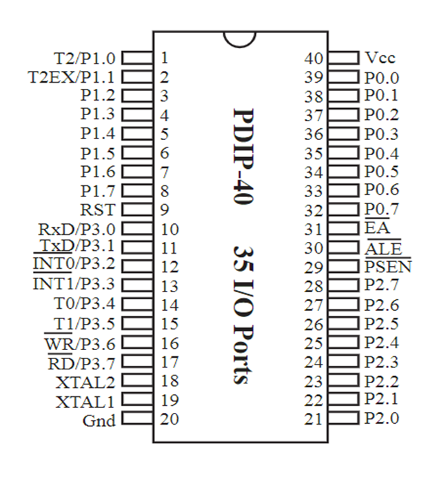

# MCU C51 Getting Started Tutorial

这篇文章为MCU(Micro Controller Unit) 8051的入门教程

## Purchase the hardware

学习MCU需要购买一下

- STC89C52RC-40I-PDIP40：单片机学习的主角。
- 系统板：针对MCU设计的电路，方便我们使用单片机。推荐选择集成电子模块的系统板，比如**YL-39系统板**，避免前期频繁采购硬件、连接电路等问题；也可以选择**最小系统板**。
- 用于 `USB to TTL` 的电子模块：本人使用搭载CH340芯片的硬件，W11默认有驱动，如果无则安装驱动。
- 杜邦线：用于接线，颜色，公公、公母、母母连接方式都买些，毕竟便宜。

> 注释：
>
> - DIP（Daul Inline Package）：MCU使用的封装手段，但由于这种分装引出的阵脚不方便接线，所以需要再买个最小系统板；
> - 杜邦线：美国杜邦公司生产的排线，英文称作 `Jumper Line` 。

此外，还可以选购面包板等一些硬件。

## Introduce Hardware to be Used

### STC89C52RC

由于采用DIP，共计40个引脚

放置单片机使其脚延伸方向远离你，缺口方向在左端，其引脚从坐下逆时针顺序分别为1-40。

Transmit Data (TxD or TD)

Receive Data (RxD or RD)

### CH340

### Check the hardware if it's available

**Test whether the port serial of CH340 can working properly**

用杜邦线将 `RXD` 和 `TXD` 短接，再将CH340插入电脑，用 `Vofa+` 等软件发送串口信息，检查是否能收到串口信息，能收到则连通，否则不连通。

## Introduce Software to be Used

### Windows

- keil uVersion5 C51：IDE工具，用于编译可用于51单片机的代码，内置交叉编译工具集。
- STC-ISP：STC公司单片机的烧录工具。

> **交叉编译**行为是指在宿主机上编译不同的指令集架构的代码。

### Linux

- stdd
- stcgal

## Reference

- [USB to TTL 文档](https://www.cnblogs.com/ppqppl/articles/16758861.html)
- [STC-ISP 与 Keil vVersion5 C51 创建项目](https://zhuanlan.zhihu.com/p/477491382)

## 电路

###  CH340 - STC89C51RC

使用杜邦线，下面是CH340到STC89C51RC杜邦线连接方向。

| CH340 | STC89C51RC |
| ----- | ---------- |
| 5V    | VCC        |
| GND   | GND        |
| RXD   | TXD        |
| TXD   | RXD        |

## 软件使用

STC-ISP 在 `下载/编程` 的时候需要先按用鼠标点击 `下载/编程` 再接电源线，否则会无法识别单片机。

## 开发

类型扩充定义：

| Micro | Means                           |
| ----- | ------------------------------- |
| sfr   | 8 bit special function register |
| sbit  | special bit                     |