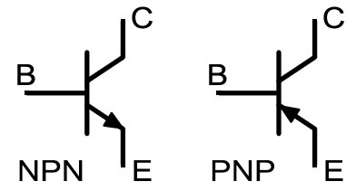
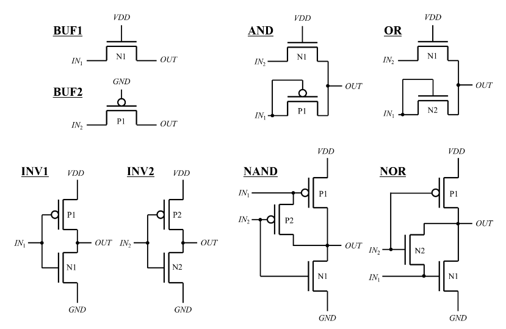

# Frome Transistor to CPU Analog Design

我们要意识到现在的计算机上存在着许许多多的N型和P型的晶体管（transistor），具体的数量和排列方式取决于设计。

*一般是使用光刻机将将图案投影到硅片上，制造芯片的各种结构。*

## Structure of Transistors

晶体管包括：

- 场效应管（FET，Feild Effect Transistor），有栅极（gate）、漏极（Drain）和源极（Source）
- 双极晶体管（BJT，Bipolar Junction Transistor），有发射极（Emitter）、基极（Base）和集电极（Collector）

### FET

MOSFET（Metal Oxide Metal Oxide Semiconductor FET）是常见的FET，常用于CPU。

The following is a simplified structure of an n-type **MOS (NMOS)** device.

MOS (NMOS) Transistor symbols and switch-level models

### BJT

下面是N型BJT

Symbols

## Transistor for Logic Gates

The following image is excerpted from [GateRL](https://www.mdpi.com/2079-9292/10/9/1032?type=check_update&version=1).

