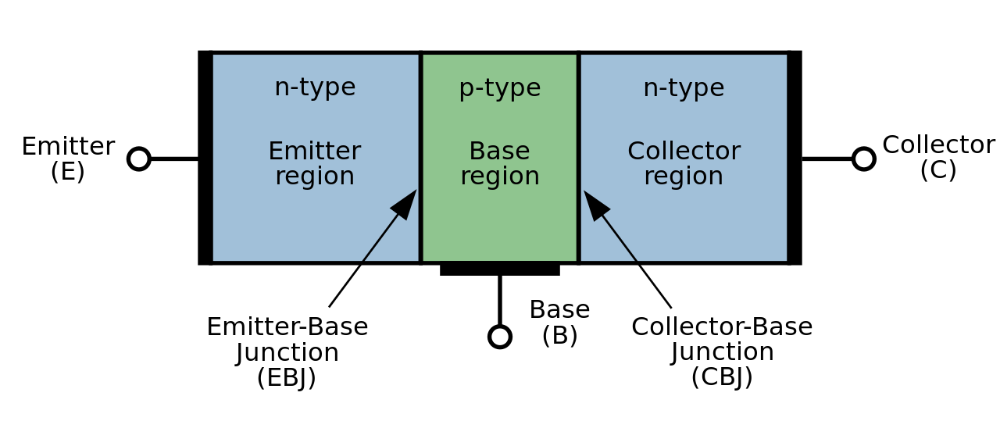
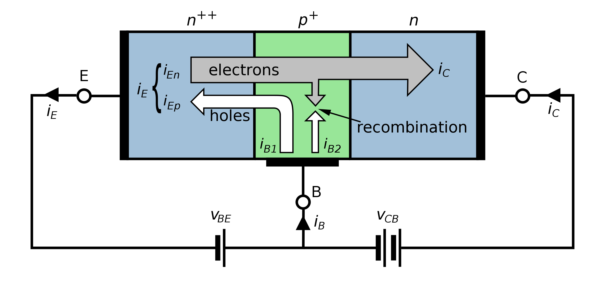
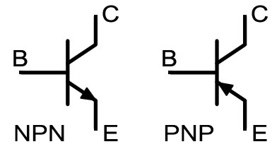
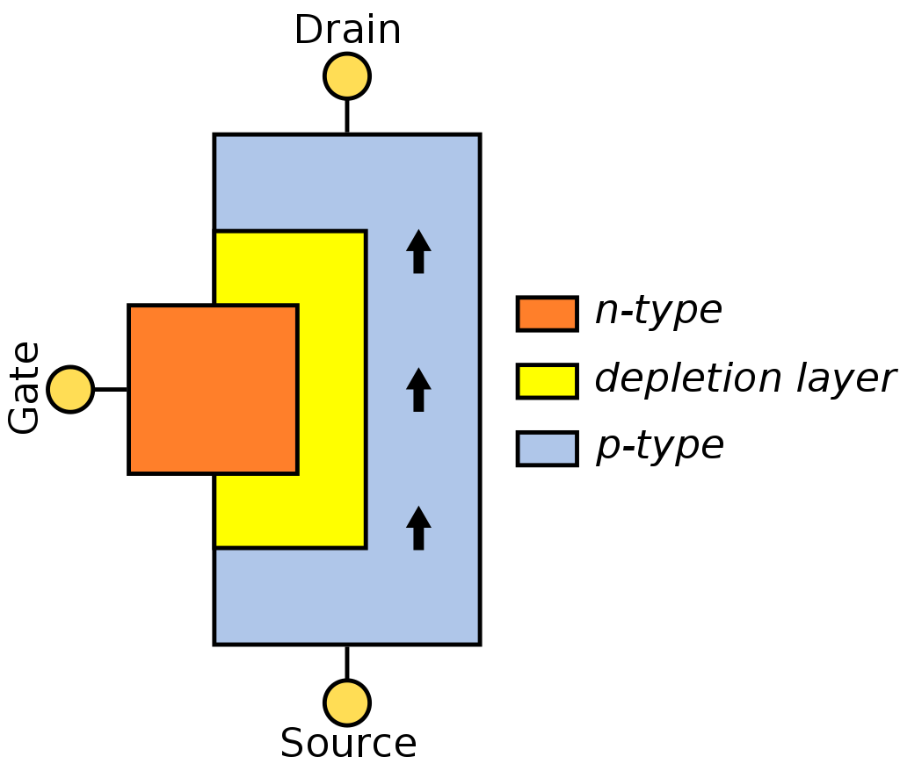
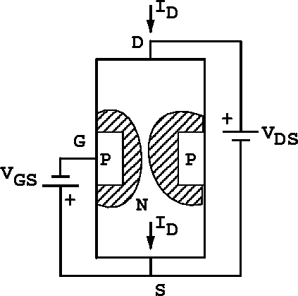
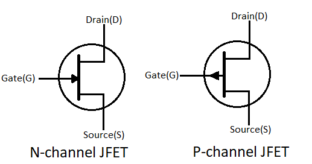
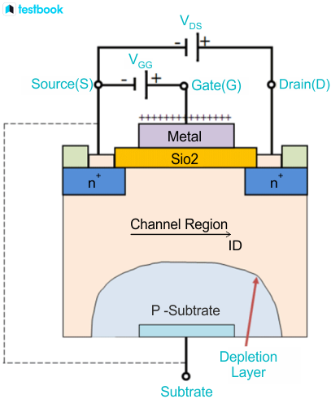
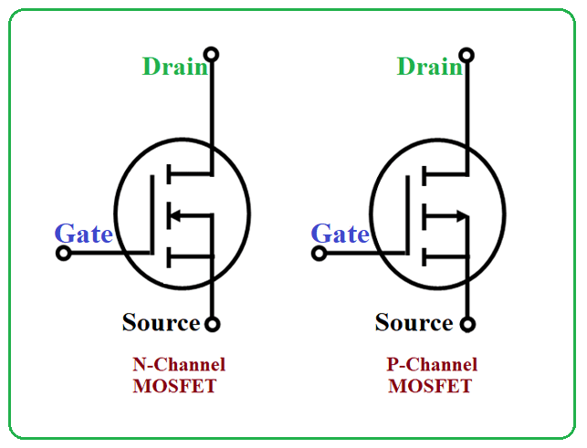
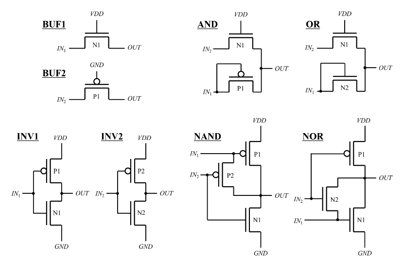

# 揭秘晶体管

## History

**热电子发射现象（1879年）：**霍尔观察到在一些导体中，当它们受到热能激发时，电流的流动方向会受到影响。

**第一款真空管（1883年）：** 美国发明家托马斯·爱迪生早在1883年就设计了一种早期的真空管，被称为“爱迪生效应”的草图。然而，由于技术限制和实际困难，他并没有成功制造出这个设备。

**霍普金斯真空管（1884年）：** 美国的霍普金斯教授（Professor John Ambrose Fleming）在1884年设计并获得了一项真空管的专利，被称为二极管。这个设备基于热电子发射原理，由于其对电子流的整流作用，因此被广泛应用于收音机等通信设备中。

**三极管的发明（1907年）：** 由英国科学家李·德·弗雷斯特（Lee De Forest）发明的三极管是真空管技术的一项重大创新。它引入了一个额外的控制极（栅极），使得电子流可以通过控制电流而实现放大。这是早期放大器技术的里程碑。

**真空管的商业应用（1920年代）：** 真空管在20世纪20年代迅速发展，并成为无线电和通信领域的主要元件。它被广泛用于放大、检波和发射信号。收音机、电视机、通信设备等大量电子产品采用了真空管技术。

**战时技术发展（1940年代）：** 在第二次世界大战期间，真空管的技术得到了进一步的发展，应用于军事通信、雷达和计算机等军事技术中。这个时期还见证了计算机的早期阶段，如ENIAC计算机采用了大量的真空管。

**晶体管的出现（1947年）：** 贝尔实验室的瓦尔特·布拉坦（Walter Brattain）和约瑟夫·巴丁（John Bardeen）发明了晶体管，它是一种使用半导体材料的新型电子器件，取代了真空管的一些应用。晶体管的出现标志着半导体时代的开始。

## Transistor Feature

该章节介绍不同种类的晶体管的特性。

### 真空管

真空管/电子管（Vaccum Tube）

[学计算机的都应该看--电子管的原理 - bilibili](https://www.bilibili.com/video/BV1Pu411N74Q/?spm_id_from=333.337.search-card.all.click&vd_source=24924a2b6e399f6354bb051bd87d3bb1)

### 双极型晶体管

双极型晶体管（BJT，Bipolar Junction Transistor），有发射极（Emitter）、基极（Base）和集电极（Collector），俗称三极管。

#### 类型

晶体管根据带电属性通常被分为：PNP（P型）、NPN（N型）晶体管。

*P是指Positive（带正电），N是指Negative（带负电）。*

#### 结构

NPN（N型），左边N为高浓度掺杂，右边N为低浓度掺杂。

#### 原理

当B极有电子移动到 $V_{BE}$ 的时候，将吸引高浓度电子的E极大量电子涌入B极，但是 $V_{BE}$ 能力有限，多余的大量电子将在作用力下涌入到 $V_{CB}$，从而达到BE的小电流控制CB的大电流。

[终于有人讲了，凭什么三极管能放大? - bilibili](https://www.bilibili.com/video/BV1fB4y147Gn/?spm_id_from=333.337.search-card.all.click&vd_source=24924a2b6e399f6354bb051bd87d3bb1)

[芯片里面的100亿晶体管！到底是什么？ - bilibili](https://www.bilibili.com/video/BV1Kj411Q7an/?spm_id_from=333.337.search-card.all.click&vd_source=24924a2b6e399f6354bb051bd87d3bb1)

#### 符号

Emitter 和 Base 的电流方向由带电属性决定：当Emitter为N、Base为P时，电流从B到P，否则反之。

### 场效应管

场效应管（FET，Feild Effect Transistor），有栅极（Gate）、漏极（Drain）和源极（Source）。

根据沟道类型分为N沟道（N Chennel）和P沟道（P Chennel）。

FET相比较BJT利用电流控制开关，FET采用电压控制开关，因此FET对于晶体管的高度集成的电路更适用，可以避免电流过大烧坏电路，所以更适用与CPU。

#### 结型场效应管

结型场效应管（JFET，Junction FET）。

##### 结构

P-Channel JFET structure:

耗尽层（英语：depletion region），又称耗尽区、阻挡层、势垒区（barrier region），**是指PN结中在漂移运动和扩散作用的双重影响下载流子数量非常少的一个高电阻区域**。

##### 原理

针对P沟道，对N型Gate施加反向偏置电压（比如-5V），会增强N型的吸引正电荷的强度，从而会在P沟道中形成一个耗尽层，当电压足够大的时候，Source到Drain的电路断开。

[很通俗的解释 JFET的工作原理 比MOS管简单很多 结型场效应管的工作原理 - bilibili](https://www.bilibili.com/video/BV1ne4y1y7Nt/?spm_id_from=333.337.search-card.all.click&vd_source=24924a2b6e399f6354bb051bd87d3bb1)

##### Symbols

#### MOS场效应管

MOSFET（Metal Oxide Semiconductor FET）

##### 结构

1. **Metal（金属）：** 这是指MOSFET的栅极部分，通常是金属材料。栅极的电压通过栅极和半导体之间的氧化物（通常是二氧化硅）来控制电流流动。
2. **Oxide（氧化物）：** 这是指MOSFET中氧化物的层，通常是金属和半导体之间的二氧化硅层。这一层的存在是为了隔离栅极和半导体，以防止电流直接通过，从而实现栅极对通道电流的控制。
3. **Semiconductor（半导体）：** 这是指MOSFET的半导体部分，即通道，通常是硅。通过在半导体中形成一个可控的电荷通道，MOSFET能够通过调节栅极电压来控制电流的流动。

The following is a simplified structure of an N channel **MOS (NMOS)** device.

##### 原理

[Mos管的工作原理 - bilibili](https://www.bilibili.com/video/BV1344y167qm/?spm_id_from=333.337.search-card.all.click&vd_source=24924a2b6e399f6354bb051bd87d3bb1)

##### 符号

## Analog Design

该章节讲述讲述“逻辑电路设计”与“晶体管（Transistor）”的关系，以帮助工作在“逻辑电路设计”的朋友了解该工作对计算机（CPU设计）的意义，避免抽象的设计方式导致的学科断层。晶体管具有**开关功能**，这个是实现数字逻辑功能的关键。

**CPU上存在着大量的晶体管**（P型或者N型），具体的数量和排列方式取决于设计。一般是使用光刻机将将图案投影到硅片上，制造芯片的各种结构。

以下是常见的逻辑门对应的JFET组合方式（image from [GateRL](https://www.mdpi.com/2079-9292/10/9/1032?type=check_update&version=1)）：

在实际的电路中可能会有其他的更好的排列组合方式。
