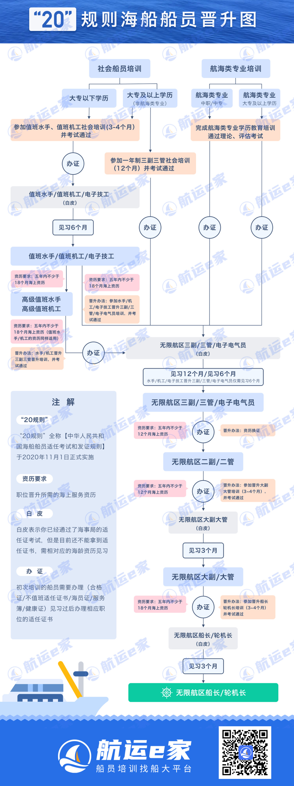

# 海员成长日记

2024年3月20日，在`航运e家`报名机工培训。

我自身的学历可以满足报名`海手/机工`（也称作值班）、`三副/三官`培训。

很明显`三副/三管`级别和待遇要高于`海手/机工`，为什么我还是选择了`海手/机工`？

在分析我做这个选择的原因之前，我们先多方位了解以下这些岗位。

关于船员资质问题，中国政府官方发布的[20规则](https://www.gov.cn/zhengce/zhengceku/2020-07/14/content_5526802.htm)有作说明。

关于岗位晋升，可以参考该图：

报名培训价格：海手/机工7000左右，三副三管15k到20k不等。

我出于以下几个角度的考量：

1. 入职速度，错过了最近一期的`三副/三管`培训报名，新的一期在九月还有半年，但近期的`海手/机工`培训还在，`海手/机工`可以更快完成培训参与到岗位；
2. 投入与风险。`三副/三管`投入成本（时间金钱）高，如果放弃该岗位沉默成本高，因此存在较高风险；考虑下一期的`三副/三管`考试还有六个月时常，从当前时间算起，加上这个六个月的时间，就当前新规，如果都按照最快速度晋升，距离正式正式三副，`海员/机工`速度也只是慢了半年不到；

---

2024年3月25日

今天到开班的日子了，之前我报的机工，后面我通过共同培训的朋友了解，机工的噪音比较大，对听力不好，然后我考虑到听力不可逆的原因，我打算临时转成水手，虽然水手也风吹日晒，但是他们沟通的内容会比较多，考虑到培训完后我想报远洋货船，有概率会遇到国外的人，水手会经常沟通，可以锻炼英语和学习他们文化以及个人性格。当我产生这个想法的时候，我就在22号晚去问了培训学校相关的负责人，他们说没问题，并在23日当天当面确认，然后我又联系了我报名的“中介”航运e家，他们也在后台帮我们作了修改。

我在23日的中午12点到了福州的他们指定的“福建航运学校”（中专，在马尾的山上），开启我的牛马生活……

都说成为水手会有很多坑，我认为踩坑的原因很大程度是因为信息收集不全面导致的。

虽然我收集的信息不是很全面，但我自认为我防骗意识是很强的，没想到还是踩了我认为三个坑：

1. 首先航运e家也是中介形式，他们收费还是高于原本学校的收费的，具体原先学校收费多少每做调查，但勋位这边的朋友我有了解他们是先直接联系这个学校这个培训的负责人进行报名，到目前暂时还没缴费，我想费用应该是低于我在航运e家的费用，但是最多不差1000RMB；
2. 培训学校内部还会宰你，得益于这个学校的建在荒郊野岭上，再加上中专严管出入（虽然可以后面办出入证，但也增加我们出门成本），学校的吃的快餐的伙食，交的费用还很高，伙食味道也不行，超市同理；
3. 我犯的最大的错误就是，误以为一年制的三副三管的报班需要等到九月，最近也就是3月24日晚才了解到4月份也有三副三管培训，并且学校更好，很大概率不会遇到培训学校内部宰你的情况。但是已经不在工作日了，如果更改的话按照约定无法退还费用，但是我还是坚持之前的考虑，水手试错成本低。虽然通过最近对新老水手以及他们周边具有相关职业亲戚关系的了解，我更加坚定海员的道路。

继续分析第三点，在晋升同等正式三副的时候，水手需要的时间为：

乐观情况下：3（水手培训）+6（水手实习）+12（正式）+8（三副培训）+6（三副实习）= 35个月

同样一年制三副三管需要的时间为：

乐观情况下：12（三副培训）+12（实习）=24（个月）

一年制的三副三管相较前者乐观情况下快了11个月，如果考虑船之间的空窗期。假设换船的空窗期为3个月，悲观角度看换船数量，水手到正式三管需要4条船，需要12个月；而一年制的三副三管两条船就可以转正，需要6个月，悲观角度来看，水手需要46月能达到正式三副，而一年制三副三管30个月就能达到正式三副。差了近一年半。

但从海上的工作资历来看，相同时间前期水手的工作时间资历长，但稳定后水手和三副的工作时间相同。后期的正式三副后，一年制三副会比水手多出一年的正式工资差：
$$
12\times(n_{一年制三副}-n_{水手})\\
n为月薪
$$
所以一年制的三副有两个很大的优势：晋升快（多出的时间可以更快的晋升二副），工资高。缺点是：前期投入多，时间和金钱。

在这样的整理下我就越发觉得我报名水手不是明智的选择，因为我想比较快的速度得到晋升，并中长期坚持在这个职位。但是迫于无奈资金以及冲动已经报名水手（无法退费）的原因，先把水手培训完吧，而且即使我有这个决心，到海上可能又是另外一幅场景，半途而废的话水手还是低成本划算的。各有利弊，自己权衡吧。目前就选择水手这个干下去看看吧。

---

2024年3月26日

昨天做了开班宣讲，主要就是四点：

1. 拍照，为后续海事局开户以及疫苗证件使用；
2. 发课本；
3. 学校规定：
   1. 不和该校中专生产生联系；
   2. 不许喝酒（抽烟不禁止）；
   3. 注意宿舍用电安全；
   4. 人际关系处理；
4. 学习安排。

今天正式开课了，现在培训要求每天上下午签到，要求定位和人脸拍照，确保你在学校接受培训（杜绝了代办灰色业务）。今天讲的内容是《基本安全--基本急救》，这本比较薄，今天一天就讲完了，来教我们是一位小美女，年龄应该和我相仿或比我大一些。由于我高中生物还蛮不错，对于养生健身有些了解，通过他一天的讲解我判断她应该高中文科生、或者是中专生，他对于一些知识了解片面甚至错误，但是她对于药品了解还算全面，我考虑她是中专生考的药师资格证，她人物也很简单，就是带我们读完一遍书本，她稍作延伸（虽然她延伸的很多点是错误的……）。

一天一本书，大家还是比较配合老师的，虽然有一部分上课玩游戏，我还是喜欢这种上课的氛围的。

说到学生的成分，退伍军人占一些，大龄（30-50）男人占一大部分，学历低无目标年轻人（18-20）占一部分，本科学历都很少见，但是今天了解到还有一个研究生在报名海员，内心五味杂陈……
